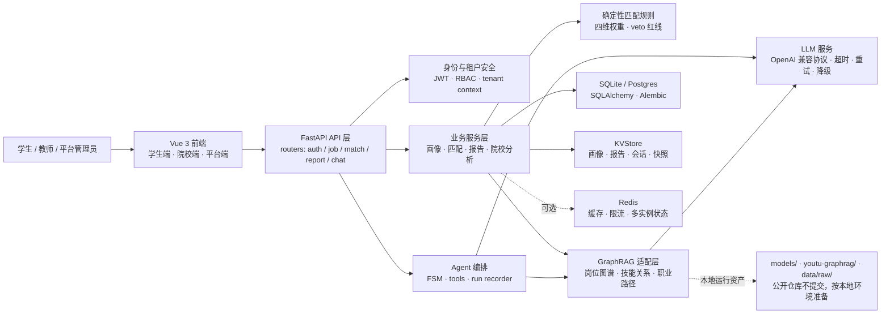

# 基于 AI 的大学生职业规划智能体

> 赛题：A13《基于 AI 的大学生职业规划智能体》
> 定位：面向高校就业场景的 GraphRAG + Agent + 规则约束 AI 应用
> 版本：3.0.0

本项目面向高校在校生与应届毕业生，围绕“简历上传 → 学生画像 → 人岗匹配 → 职业路径 → AI 咨询 → 报告生成”的闭环，构建可演示、可降级、可扩展的职业规划系统。

---

## 核心能力

- **GraphRAG 检索增强**：基于 YOUTU-GraphRAG 的岗位、技能、证书、晋升与转岗关系，支持 L1 属性、L2 实体、L3 关键词、L4 社区多层检索。
- **七维度学生画像**：从 PDF / DOCX / TXT 简历中提取技能、证书、创新、学习、抗压、沟通、实习等画像信息。
- **四维度人岗匹配**：基础要求、技能匹配、素质匹配、发展潜力统一由 `app/services/match_rules.py` 管理，默认权重为 `25% / 35% / 25% / 15%`。
- **AI Agent 咨询**：通过 FSM、工具调用、图谱检索和业务规则约束回答，减少纯 LLM 幻觉。
- **职业报告生成**：输出职业匹配分析、路径规划、行动计划和评估指标，并支持 PDF / Word 导出。
- **企业化底座**：支持 JWT、RBAC、多租户、PII 加密、Redis/Postgres/检索微服务可选降级。

---

## 技术栈

| 层次 | 技术 |
|---|---|
| 后端 | FastAPI · Uvicorn · SQLAlchemy · Alembic · Pydantic |
| 前端 | Vue 3 · Vite · Pinia · Arco Design · ECharts |
| AI 检索 | YOUTU-GraphRAG · FAISS · sentence-transformers · all-MiniLM-L6-v2 |
| LLM 接入 | OpenAI 兼容协议，支持 DeepSeek / Qwen / Groq 等 Provider |
| 文档解析 | PyMuPDF · python-docx |
| 报告导出 | reportlab · python-docx |
| 工程化 | Redis 可选缓存 · Postgres 生产库 · Docker Compose · 环境模板 |

---

## 架构总览



**核心取舍**：LLM 负责理解和生成，GraphRAG 负责岗位知识 grounding，`match_rules` 负责确定性打分和红线控制，工程层负责多租户、安全、降级与可观测性。

---

## 当前目录结构

```text
fuchuang2.0/
├── app/                         # FastAPI 后端应用
│   ├── main.py                  # 应用入口、路由挂载、健康检查、指标
│   ├── config.py                # 环境变量与运行配置
│   ├── routers/                 # API 翻译层：auth/student/job/match/report/chat/analytics 等
│   ├── services/                # 业务服务：GraphRAG、匹配规则、状态存储、报告、租户配置
│   ├── core/                    # 数据库、LLM、Redis、PII、可观测、韧性组件
│   ├── agents/                  # Agent 状态机、工具注册与运行记录
│   └── models/                  # SQLAlchemy ORM 模型
├── frontend/                    # Vue 3 前端
│   └── src/
│       ├── api/                 # 前端 API 封装
│       ├── features/            # 学生端、院校端、平台端功能页面
│       ├── layouts/             # 三类角色布局
│       ├── stores/              # Pinia 状态
│       └── lib/                 # HTTP、SSE、通用工具
├── retrieval_service/           # 可选独立检索微服务
├── data/
│   ├── raw/                     # 原始/预处理招聘数据
│   └── career/                  # 技能关键词、权重等业务配置
├── examples/                    # 脱敏 demo 数据与 API 请求样例
├── alembic/                     # 数据库迁移
├── run.py                       # 本地后端启动入口，默认端口 8082
├── docker-compose.yml           # 生产拓扑示例：backend + retrieval + Redis + Postgres
└── requirements.txt             # 后端依赖
```

> 公开仓库默认不包含本地运行资产（`/models/`、`/youtu-graphrag/`、`/data/raw/`）。基础流程可使用 `examples/` 中的脱敏 demo 数据验证。

---

## 本地运行资产

### 是否必须下载 `youtu-graphrag/`？

**不必须。** 公开仓库默认按 Demo Mode 组织：没有 `youtu-graphrag/`、本地 embedding 模型和原始招聘数据时，后端仍可启动，登录、画像、基础匹配、报告等基础流程可通过 `examples/` 中的脱敏数据验证。

如果需要完整 GraphRAG 能力，则进入 Full Mode：需要在项目根目录准备 `youtu-graphrag/`、`models/all-MiniLM-L6-v2/` 和授权招聘数据，并按职业领域 schema 生成图谱与 FAISS 缓存。

结合当前实现，`app/services/youtu_retriever_service.py` 会尝试从 `youtu-graphrag/` 导入官方检索组件：

- `models.retriever.enhanced_kt_retriever.KTRetriever`
- `models.retriever.agentic_decomposer.GraphQ`

同时读取以下运行资产：

- `youtu-graphrag/schemas/career.json`
- `youtu-graphrag/output/graphs/career_new.json`
- `youtu-graphrag/retriever/faiss_cache_new/career/`
- `models/all-MiniLM-L6-v2/`

这些路径对应 [Youtu-GraphRAG](https://arxiv.org/abs/2508.19855) 的官方思路：用 schema 约束图谱构建，基于层级知识组织与 agentic retriever 做复杂问题分解和图谱检索。本项目只保留适配层与业务服务代码；第三方 vendor、模型权重、原始数据和预构建索引属于本地/授权运行资产，不随公开仓库发布。

如果官方组件或运行资产缺失，适配器会把 `YOUTU_AVAILABLE` 置为不可用，并回退到内置岗位/技能检索或返回空结果；这不是缺文件导致项目不可运行，而是公开 Demo 的预期降级行为。

| 资产 | 路径 | 说明 |
|---|---|---|
| GraphRAG 引擎/图谱 | `youtu-graphrag/` | Full Mode 才需要；公开仓库不提交第三方 vendor 与预构建索引 |
| 嵌入模型 | `models/all-MiniLM-L6-v2/` | Full Mode 建议本地准备；缺失时可能尝试按模型名加载或走降级 |
| 招聘数据 | `data/raw/preprocessed_for_llm.csv` | 授权数据，本地用于市场数据与样本检索；公开仓库仅保留说明 |
| 原始表格 | `data/raw/20260226105856_457.xls` | 企业/比赛原始数据冷备，不进入公开仓库 |

缺少这些资产时，核心后端仍可启动；GraphRAG、市场样本和职业知识增强相关接口会走内置降级或返回空结果。

---

## 快速开始

### 1. 配置环境变量

复制 `.env.production.example` 或新建 `.env`，开发环境至少配置：

```ini
APP_ENV=development
AUTH_ENFORCED=false
LLM_PROVIDER=deepseek
LLM_API_KEY=your_api_key
LLM_BASE_URL=https://api.deepseek.com
LLM_MODEL=deepseek-chat
JWT_SECRET=your-random-secret-at-least-32-chars
```

> 无 LLM Key 时系统会走规则兜底，但 AI 解析与对话效果会降级。

### 2. 安装依赖

```bash
# 后端
python -m venv .venv
.venv\Scripts\activate
pip install -r requirements.txt

# 前端
cd frontend
npm install
```

### 3. 启动服务

```bash
# 终端 1：后端，默认 http://localhost:8082
.venv\Scripts\python.exe run.py

# 终端 2：前端，默认 http://localhost:5173
cd frontend
npm run dev
```

访问：

| 地址 | 说明 |
|---|---|
| `http://localhost:5173` | 前端主界面 |
| `http://localhost:8082/docs` | FastAPI Swagger 文档 |
| `http://localhost:8082/ready` | 就绪探针 |
| `http://localhost:8082/metrics` | 指标快照 |

---

## Public Demo

公开仓库提供一套脱敏 demo，便于在没有原始数据、模型权重和 GraphRAG vendor 的情况下验证基础流程。

```bash
# 初始化 SQLite 表结构，并写入 demo 租户、demo 学生账号和画像
.venv\Scripts\python.exe examples\seed_demo.py
```

默认 demo 账号：

| 字段 | 值 |
|---|---|
| 用户名 | `demo_student` |
| 密码 | `Demo@123456` |
| 租户 | `demo-school` |
| 学生 ID | `00000000-0000-4000-8000-000000000001` |

可配合 `examples/demo_requests.http` 依次验证登录、读取画像、人岗匹配和岗位推荐。示例简历见 `examples/demo_resume.txt`，画像样例见 `examples/demo_portrait.json`。

---

## 核心接口

| 分组 | 端点示例 |
|---|---|
| 认证 | `POST /api/auth/register` · `POST /api/auth/login` · `GET /api/auth/me` |
| 简历画像 | `POST /api/resume/parse` · `GET/PUT /api/portrait/{student_id}` |
| 岗位图谱 | `GET /api/jobs/info` · `GET /api/jobs/career-graph` · `GET /api/jobs/search` |
| 人岗匹配 | `POST /api/match/compute` · `POST /api/match/batch` · `GET /api/match/recommend/{student_id}` |
| 报告 | `POST /api/report/generate` · `GET /api/report/{report_id}` · `POST /api/report/{report_id}/polish` |
| 对话 | `POST /api/chat/session` · `POST /api/chat/stream` |
| 院校/平台 | `GET /api/analytics/*` · `GET/POST /api/admin/*` · `GET /api/platform/*` |

---

## 质量与安全边界

- 匹配/画像指标必须通过真实样本与内部评测流程计算，不能硬编码结果。
- 涉及匹配规则、技能治理、画像抽取的改动，需要在本地或私有环境完成回归验证。
- 公开仓库只保留可运行源码、脱敏示例和环境模板；本地脚本、测试资产与过程文档不作为公开交付物。

## 文件管理原则

- 源码放 `app/`、`frontend/src/`、`retrieval_service/`。
- 原始和预处理数据放 `data/raw/`，业务配置放 `data/career/`。
- 本地大模型、GraphRAG vendor、图谱和 FAISS 索引作为运行资产管理，不和业务代码混放。
- 脱敏 demo 放 `examples/`，本地文档、脚本和测试资产不进入公开仓库。
- `.venv/`、`node_modules/`、`dist/`、日志、缓存、`.env` 不提交仓库。

---

## 许可证

MIT License
